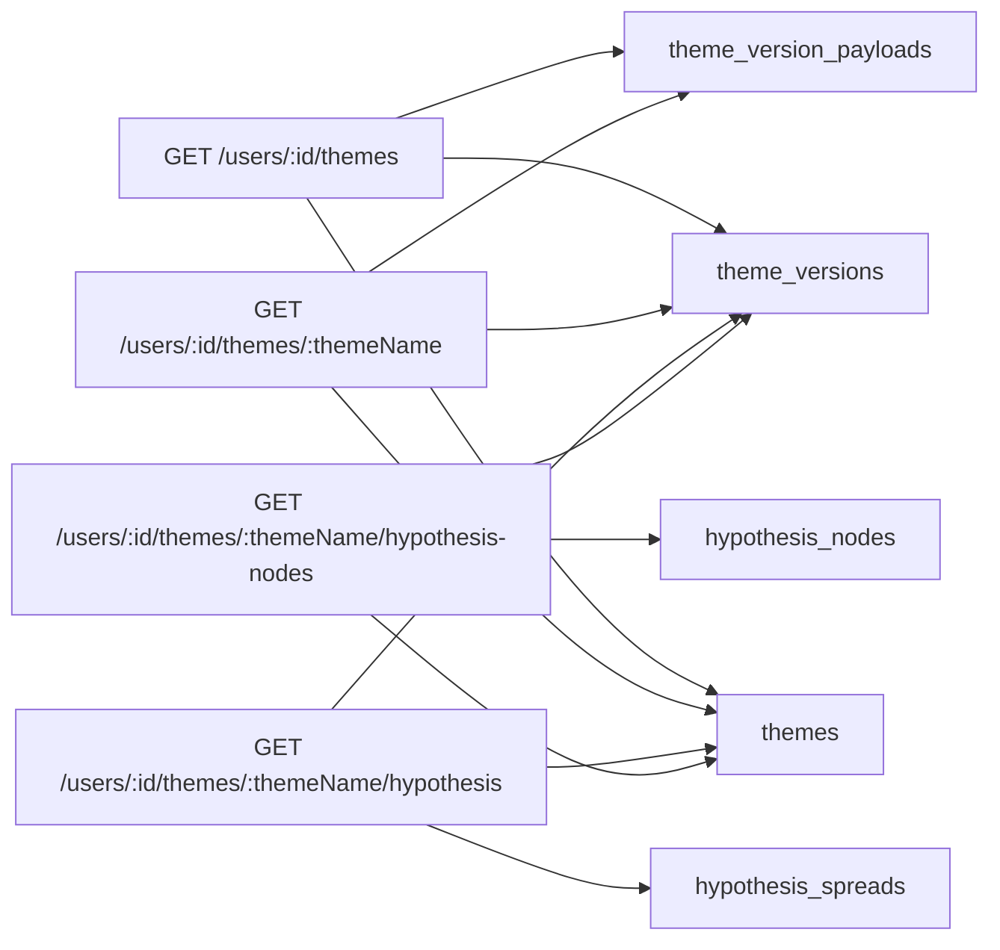
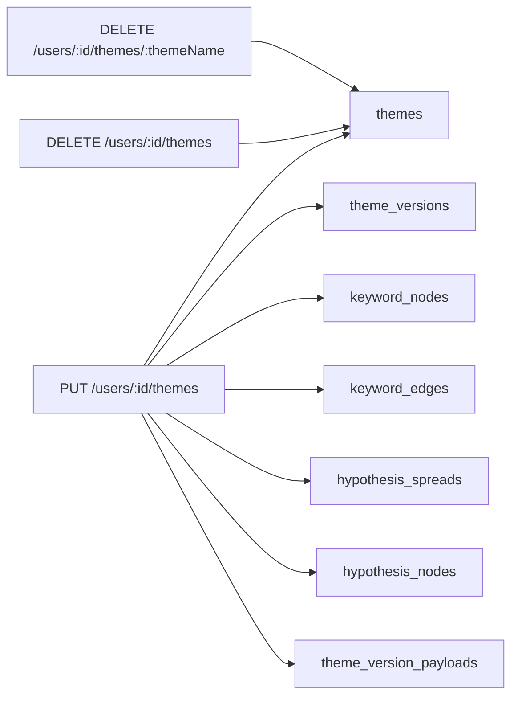
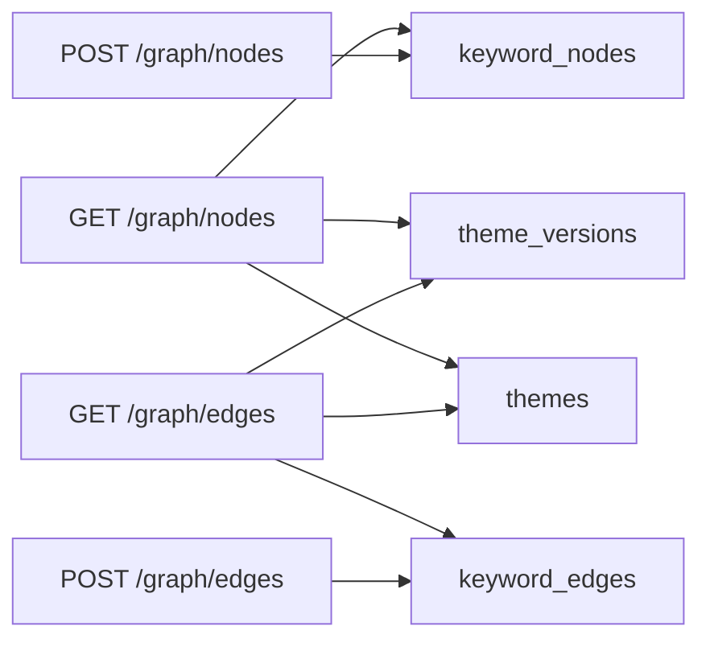
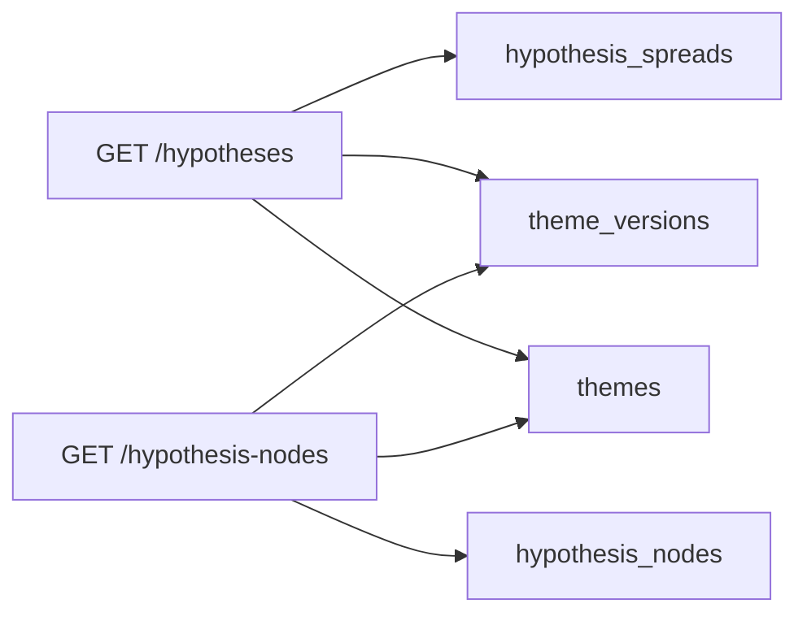

# API V2 クイックリファレンス

最終更新: 2026-02-17

このドキュメントは、現在の V2 運用（テーマ/仮説/グラフ）における主要 API の最小仕様をまとめたものです。

## 前提

- テーマ系読み取りAPIは `ENABLE_V2_READ=true` が前提です
- V2テーブル未作成時は、テーマ系APIは `503` を返します
- 例のベースURL: `http://127.0.0.1:3000`

## 認証・ユーザー

### POST /users
- 用途: ユーザー作成
- Body:
```json
{ "id": "user1", "passwordHash": "password123" }
```

### GET /users
- 用途: ユーザー一覧
- Query: `limit` (任意)

### PUT /users/:id
- 用途: パスワード更新
- Body:
```json
{ "passwordHash": "newPassword123" }
```

### PUT /users/:id/password
- 用途: 現在パスワード検証つき更新
- Body:
```json
{ "currentPassword": "old", "newPassword": "new" }
```

### DELETE /users/:id
- 用途: ユーザー削除
- 動作: `users` 行削除（FK連鎖で V2 テーマ系データも削除）

### POST /auth/login
- 用途: ログイン確認
- Body:
```json
{ "id": "user1", "password": "password123" }
```

## テーマ・仮説（V2）

### GET /users/:id/themes
- 用途: テーマ一覧（V2）
- Response要素:
```json
{ "themeName": "再生可能エネルギー", "content": {"title":"..."}, "updatedAt": "..." }
```

### GET /users/:id/themes/:themeName
- 用途: テーマ1件取得（V2）

### PUT /users/:id/themes
- 用途: テーマ保存（V2）
- Body:
```json
{
  "themeName": "再生可能エネルギー",
  "content": {
    "title": "再生可能エネルギー",
    "nodes": [],
    "edges": []
  }
}
```
- 備考: 既存内容とマージして新しい version を追加

### DELETE /users/:id/themes
- 用途: ユーザーの全テーマを論理削除（`themes.deleted_at`）

### DELETE /users/:id/themes/:themeName
- 用途: テーマ1件を論理削除

### GET /users/:id/themes/:themeName/hypothesis
- 用途: 仮説本文（1テーマ）取得
- 返却: `html`, `savedAt`, `nodeCount`, `summary` など

### GET /users/:id/themes/:themeName/hypothesis-nodes
- 用途: 仮説ノード一覧（1テーマ）取得

### GET /hypotheses
- 用途: 仮説一覧（横断）
- Query: `limit`, `userId`（任意）

### GET /hypothesis-nodes
- 用途: 仮説ノード一覧（横断）
- Query: `limit`, `userId`, `themeName`（任意）

## グラフ（V2）

### GET /graph/nodes
- 用途: グラフノード一覧
- Query:
  - `limit` (任意)
  - `themeVersionId` (任意)
  - `userId` (任意)
  - `themeName` (任意)

### POST /graph/nodes
- 用途: グラフノード作成
- 必須: `themeVersionId`, `label`
- 推奨: `clientNodeId`
- Body例:
```json
{
  "themeVersionId": 11,
  "label": "キーワードA",
  "clientNodeId": "node_a",
  "nodeType": "keyword",
  "x": 100,
  "y": 120,
  "props": { "source": "manual" }
}
```

### GET /graph/edges
- 用途: グラフエッジ一覧
- Query:
  - `limit` (任意)
  - `themeVersionId` (任意)
  - `userId` (任意)
  - `themeName` (任意)

### POST /graph/edges
- 用途: グラフエッジ作成
- 必須: `themeVersionId` + `srcClientNodeId` + `dstClientNodeId`
- 互換入力: `srcId` / `dstId` も受理（内部で client node id として扱う）
- Body例:
```json
{
  "themeVersionId": 11,
  "srcClientNodeId": "node_a",
  "dstClientNodeId": "node_b",
  "relation": "related",
  "clientEdgeId": "edge_ab",
  "props": { "source": "manual" }
}
```

## ヘルス

### GET /health
- 用途: APIとDB接続の死活確認
- 正常時:
```json
{ "status": "ok" }
```

## エラーコード一覧

### 400 Bad Request
- 主な条件:
  - 必須項目不足（例: `themeName`, `themeVersionId`, `label`）
  - フォーマット不正（例: `userId` の文字種/長さ）
- 対処:
  - リクエストBody/Query/Pathの必須項目を再確認

### 401 Unauthorized
- 主な条件:
  - ログイン時の資格情報不一致（`/auth/login`）
- 対処:
  - `id` とパスワードを再確認

### 404 Not Found
- 主な条件:
  - 対象ユーザー/テーマ/仮説が存在しない
  - 削除済みテーマを参照した
- 対処:
  - 対象ID・テーマ名・URLエンコードを確認

### 409 Conflict
- 主な条件:
  - 既存ユーザーの重複作成（`POST /users`）
- 対処:
  - 別IDで作成、または既存ユーザーを更新

### 500 Internal Server Error
- 主な条件:
  - DB実行エラー、予期しない例外
- 対処:
  - サーバーログ（`console.error`）でSQL/スタックを確認

### 503 Service Unavailable
- 主な条件:
  - V2 API利用条件を満たしていない（例: `ENABLE_V2_READ=false`）
  - V2スキーマ未作成
- 対処:
  - `.env` の `ENABLE_V2_READ=true` を確認
  - `scripts/sql/20260217_db_v2_up.sql` の適用状況を確認

## API別テーブルアクセス（詳細）

### 1) テーマ閲覧フロー



### 2) テーマ保存/削除フロー



### 3) グラフAPIフロー



### 4) 横断一覧APIフロー



### API × テーブル マトリクス

| API | users | themes | theme_versions | theme_version_payloads | keyword_nodes | keyword_edges | hypothesis_spreads | hypothesis_nodes |
|---|---|---|---|---|---|---|---|---|
| POST /users | W | - | - | - | - | - | - | - |
| GET /users | R | - | - | - | - | - | - | - |
| PUT /users/:id | W | - | - | - | - | - | - | - |
| PUT /users/:id/password | R/W | - | - | - | - | - | - | - |
| DELETE /users/:id | W | W | W | W | W | W | W | W |
| POST /auth/login | R | - | - | - | - | - | - | - |
| GET /users/:id/themes | - | R | R | R | - | - | - | - |
| GET /users/:id/themes/:themeName | - | R | R | R | - | - | - | - |
| PUT /users/:id/themes | - | W | W | W | W | W | W | W |
| DELETE /users/:id/themes | - | W | - | - | - | - | - | - |
| DELETE /users/:id/themes/:themeName | - | W | - | - | - | - | - | - |
| GET /users/:id/themes/:themeName/hypothesis | - | R | R | - | - | - | R | - |
| GET /users/:id/themes/:themeName/hypothesis-nodes | - | R | R | - | - | - | - | R |
| GET /hypotheses | - | R | R | - | - | - | R | - |
| GET /hypothesis-nodes | - | R | R | - | - | - | - | R |
| GET /graph/nodes | - | R | R | - | R | - | - | - |
| POST /graph/nodes | - | - | - | - | W | - | - | - |
| GET /graph/edges | - | R | R | - | - | R | - | - |
| POST /graph/edges | - | - | - | - | - | W | - | - |

凡例:
- `R`: 読み取り
- `W`: 書き込み（更新/論理削除含む）
