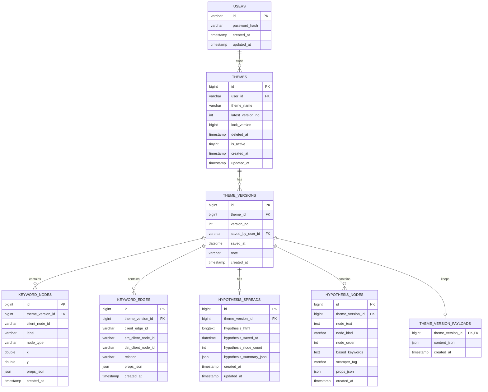
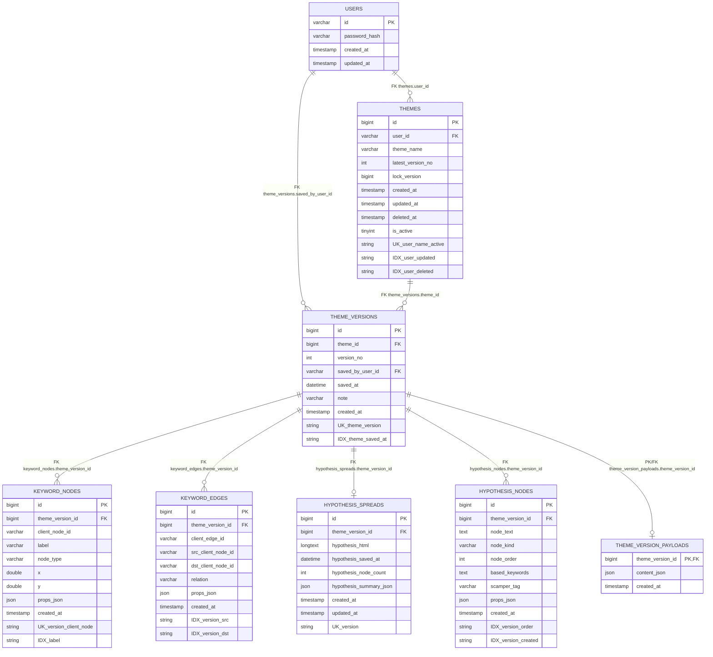

# DB再構成設計（V2案）

最終更新: 2026-02-17

## 1. 決定事項（確定）

- ID方式は `BIGINT AUTO_INCREMENT`
- 設計優先度は「整合性重視」
- 主要データは正規化テーブルへ保存（JSONは補助用途）
- 既存APIは段階移行（新旧併用）
- テーマは履歴管理あり（バージョン保持）
- テーマ削除は論理削除（`deleted_at`）
- テーマ名は論理削除後に再利用可
- 同時更新は楽観ロック（`lock_version`）
- 子テーブルは `ON DELETE CASCADE`

## 2. ERD（論理）

### 2.1 エンティティ

1. `users`
2. `themes`（テーマの論理実体）
3. `theme_versions`（テーマ保存履歴）
4. `keyword_nodes`（版単位）
5. `keyword_edges`（版単位）
6. `hypothesis_spreads`（版単位）
7. `hypothesis_nodes`（版単位）
8. `theme_version_payloads`（任意・移行期のみ）

### 2.2 リレーション

- `users (1) - (N) themes`
- `themes (1) - (N) theme_versions`
- `theme_versions (1) - (N) keyword_nodes`
- `theme_versions (1) - (N) keyword_edges`
- `theme_versions (1) - (0..1) hypothesis_spreads`
- `theme_versions (1) - (N) hypothesis_nodes`
- `theme_versions (1) - (0..1) theme_version_payloads`

## 3. 物理設計（DDL確定案）

```sql
-- 既存 users は流用前提（不足列のみ追加）
ALTER TABLE users
  ADD COLUMN IF NOT EXISTS created_at TIMESTAMP NOT NULL DEFAULT CURRENT_TIMESTAMP,
  ADD COLUMN IF NOT EXISTS updated_at TIMESTAMP NOT NULL DEFAULT CURRENT_TIMESTAMP ON UPDATE CURRENT_TIMESTAMP;

CREATE TABLE IF NOT EXISTS themes (
  id BIGINT AUTO_INCREMENT PRIMARY KEY,
  user_id VARCHAR(64) NOT NULL,
  theme_name VARCHAR(255) NOT NULL,
  latest_version_no INT NOT NULL DEFAULT 0,
  lock_version BIGINT NOT NULL DEFAULT 0,
  created_at TIMESTAMP NOT NULL DEFAULT CURRENT_TIMESTAMP,
  updated_at TIMESTAMP NOT NULL DEFAULT CURRENT_TIMESTAMP ON UPDATE CURRENT_TIMESTAMP,
  deleted_at TIMESTAMP NULL,
  is_active TINYINT(1) AS (CASE WHEN deleted_at IS NULL THEN 1 ELSE 0 END) STORED,
  CONSTRAINT fk_themes_user FOREIGN KEY (user_id) REFERENCES users(id) ON DELETE CASCADE,
  INDEX idx_themes_user_updated (user_id, updated_at),
  INDEX idx_themes_user_deleted (user_id, deleted_at),
  UNIQUE KEY uk_themes_user_name_active (user_id, theme_name, is_active)
);

CREATE TABLE IF NOT EXISTS theme_versions (
  id BIGINT AUTO_INCREMENT PRIMARY KEY,
  theme_id BIGINT NOT NULL,
  version_no INT NOT NULL,
  saved_by_user_id VARCHAR(64) NULL,
  saved_at DATETIME NOT NULL,
  note VARCHAR(255) NULL,
  created_at TIMESTAMP NOT NULL DEFAULT CURRENT_TIMESTAMP,
  CONSTRAINT fk_theme_versions_theme FOREIGN KEY (theme_id) REFERENCES themes(id) ON DELETE CASCADE,
  CONSTRAINT fk_theme_versions_saved_by FOREIGN KEY (saved_by_user_id) REFERENCES users(id) ON DELETE SET NULL,
  UNIQUE KEY uk_theme_versions_theme_version (theme_id, version_no),
  INDEX idx_theme_versions_theme_saved_at (theme_id, saved_at)
);

CREATE TABLE IF NOT EXISTS keyword_nodes (
  id BIGINT AUTO_INCREMENT PRIMARY KEY,
  theme_version_id BIGINT NOT NULL,
  client_node_id VARCHAR(128) NOT NULL,
  label VARCHAR(255) NOT NULL,
  node_type VARCHAR(64) NOT NULL DEFAULT 'keyword',
  x DOUBLE NULL,
  y DOUBLE NULL,
  props_json JSON NULL,
  created_at TIMESTAMP NOT NULL DEFAULT CURRENT_TIMESTAMP,
  CONSTRAINT fk_keyword_nodes_version FOREIGN KEY (theme_version_id) REFERENCES theme_versions(id) ON DELETE CASCADE,
  UNIQUE KEY uk_keyword_nodes_client (theme_version_id, client_node_id),
  INDEX idx_keyword_nodes_label (label)
);

CREATE TABLE IF NOT EXISTS keyword_edges (
  id BIGINT AUTO_INCREMENT PRIMARY KEY,
  theme_version_id BIGINT NOT NULL,
  client_edge_id VARCHAR(128) NULL,
  src_client_node_id VARCHAR(128) NOT NULL,
  dst_client_node_id VARCHAR(128) NOT NULL,
  relation VARCHAR(255) NULL,
  props_json JSON NULL,
  created_at TIMESTAMP NOT NULL DEFAULT CURRENT_TIMESTAMP,
  CONSTRAINT fk_keyword_edges_version FOREIGN KEY (theme_version_id) REFERENCES theme_versions(id) ON DELETE CASCADE,
  INDEX idx_keyword_edges_version_src (theme_version_id, src_client_node_id),
  INDEX idx_keyword_edges_version_dst (theme_version_id, dst_client_node_id)
);

CREATE TABLE IF NOT EXISTS hypothesis_spreads (
  id BIGINT AUTO_INCREMENT PRIMARY KEY,
  theme_version_id BIGINT NOT NULL,
  hypothesis_html LONGTEXT NOT NULL,
  hypothesis_saved_at DATETIME NULL,
  hypothesis_node_count INT NOT NULL DEFAULT 0,
  hypothesis_summary_json JSON NULL,
  created_at TIMESTAMP NOT NULL DEFAULT CURRENT_TIMESTAMP,
  updated_at TIMESTAMP NOT NULL DEFAULT CURRENT_TIMESTAMP ON UPDATE CURRENT_TIMESTAMP,
  CONSTRAINT fk_hypothesis_spreads_version FOREIGN KEY (theme_version_id) REFERENCES theme_versions(id) ON DELETE CASCADE,
  UNIQUE KEY uk_hypothesis_spreads_version (theme_version_id)
);

CREATE TABLE IF NOT EXISTS hypothesis_nodes (
  id BIGINT AUTO_INCREMENT PRIMARY KEY,
  theme_version_id BIGINT NOT NULL,
  node_text TEXT NOT NULL,
  node_kind VARCHAR(32) NOT NULL DEFAULT 'hypothesis',
  node_order INT NOT NULL DEFAULT 0,
  based_keywords TEXT NULL,
  scamper_tag VARCHAR(255) NULL,
  props_json JSON NULL,
  created_at TIMESTAMP NOT NULL DEFAULT CURRENT_TIMESTAMP,
  CONSTRAINT fk_hypothesis_nodes_version FOREIGN KEY (theme_version_id) REFERENCES theme_versions(id) ON DELETE CASCADE,
  INDEX idx_hypothesis_nodes_version_order (theme_version_id, node_order),
  INDEX idx_hypothesis_nodes_version_created (theme_version_id, created_at)
);

-- 互換維持/検証用途（移行期のみ）
CREATE TABLE IF NOT EXISTS theme_version_payloads (
  theme_version_id BIGINT PRIMARY KEY,
  content_json JSON NOT NULL,
  created_at TIMESTAMP NOT NULL DEFAULT CURRENT_TIMESTAMP,
  CONSTRAINT fk_theme_version_payloads_version FOREIGN KEY (theme_version_id) REFERENCES theme_versions(id) ON DELETE CASCADE
);
```

## 4. 保存時の整合性ルール

1. `themes.lock_version` を条件に更新（楽観ロック）
2. 成功時に `latest_version_no + 1` を採番
3. `theme_versions` を追加
4. その `theme_version_id` に紐づいてノード/エッジ/仮説を一括INSERT
5. 必要に応じて `theme_version_payloads` にJSONを保存
6. 全体を同一トランザクションでコミット

## 5. 読み取り方針

- 既定は `themes.latest_version_no` に対応する最新版を返す
- 履歴参照APIでは `version_no` 指定で過去版を返す
- 旧API互換が必要な期間は「最新版を旧レスポンス形式へ整形して返却」

## 6. 移行方針（概要）

1. 新テーブルを追加（既存テーブルは維持）
2. backfillで `user_themes` を `themes/theme_versions/...` に展開
3. APIを dual-write（旧 + 新）
4. 読み取りを新優先へ段階切替
5. 検証完了後に旧書き込み停止
6. 旧テーブル廃止は最終段階で実施

## 7. ER図（Mermaid）



### 7.1 物理ER補足（インデックス/制約）

#### 主キー / 外部キー

- `users.id` (PK)
- `themes.id` (PK), `themes.user_id -> users.id` (FK)
- `theme_versions.id` (PK), `theme_versions.theme_id -> themes.id` (FK), `theme_versions.saved_by_user_id -> users.id` (FK, `ON DELETE SET NULL`)
- `keyword_nodes.id` (PK), `keyword_nodes.theme_version_id -> theme_versions.id` (FK)
- `keyword_edges.id` (PK), `keyword_edges.theme_version_id -> theme_versions.id` (FK)
- `hypothesis_spreads.id` (PK), `hypothesis_spreads.theme_version_id -> theme_versions.id` (FK)
- `hypothesis_nodes.id` (PK), `hypothesis_nodes.theme_version_id -> theme_versions.id` (FK)
- `theme_version_payloads.theme_version_id` (PK/FK, `-> theme_versions.id`)

#### 一意制約

- `themes`: `UNIQUE(user_id, theme_name, is_active)`
- `theme_versions`: `UNIQUE(theme_id, version_no)`
- `keyword_nodes`: `UNIQUE(theme_version_id, client_node_id)`
- `hypothesis_spreads`: `UNIQUE(theme_version_id)`

#### 主要インデックス

- `themes`: `idx_themes_user_updated (user_id, updated_at)`, `idx_themes_user_deleted (user_id, deleted_at)`
- `theme_versions`: `idx_theme_versions_theme_saved_at (theme_id, saved_at)`
- `keyword_nodes`: `idx_keyword_nodes_label (label)`
- `keyword_edges`: `idx_keyword_edges_version_src (theme_version_id, src_client_node_id)`, `idx_keyword_edges_version_dst (theme_version_id, dst_client_node_id)`
- `hypothesis_nodes`: `idx_hypothesis_nodes_version_order (theme_version_id, node_order)`, `idx_hypothesis_nodes_version_created (theme_version_id, created_at)`

#### 代表的なJOIN経路

- 最新テーマ内容取得:
  - `themes t`
  - `JOIN theme_versions tv ON tv.theme_id = t.id AND tv.version_no = t.latest_version_no`
  - `LEFT JOIN theme_version_payloads p ON p.theme_version_id = tv.id`

- 仮説一覧取得:
  - `themes t`
  - `JOIN theme_versions tv ON tv.theme_id = t.id AND tv.version_no = t.latest_version_no`
  - `JOIN hypothesis_spreads hs ON hs.theme_version_id = tv.id`

- グラフ取得:
  - `themes t`
  - `JOIN theme_versions tv ON tv.theme_id = t.id AND tv.version_no = t.latest_version_no`
  - `JOIN keyword_nodes/keyword_edges`（`theme_version_id` で結合）

#### 物理モデル（詳細Mermaid）



## 8. 移行Runbook（詳細）

### Phase 0: 事前準備

- 対象DBのフルバックアップ取得
- API停止不要で実施可能だが、バックフィル中の更新競合を避けるため低トラフィック時間帯を推奨
- 検証用SQLを先に用意（件数一致、テーマ単位比較）

### Phase 1: スキーマ投入

- 本ドキュメントのDDLを適用
- 既存APIはそのまま稼働
- 新テーブルに対して読み書きはまだ行わない

### Phase 2: 初回バックフィル

- 入力: `user_themes`（`content_json` 内の nodes/edges/hypothesis を利用）
- 出力: `themes`, `theme_versions`, `keyword_nodes`, `keyword_edges`, `hypothesis_spreads`, `hypothesis_nodes`
- 生成ルール:
  - `themes`: `(user_id, theme_name)` ごとに1行
  - `theme_versions`: 初回は `version_no=1`
  - `latest_version_no=1`, `lock_version=0`

### Phase 3: 整合性検証

- テーマ件数一致（ユーザー単位/全体）
- ノード/エッジ件数一致（テーマ単位）
- 仮説HTML有無一致
- ランダムサンプリングで payload diff（N件）

### Phase 4: dual-write 有効化

- `PUT /users/:id/themes` を新旧両方へ書き込み
- 失敗条件:
  - 旧成功・新失敗 → エラー返却し、運用ログに必ず記録
  - 旧失敗・新成功 → 同上
- この段階では読み取りは旧優先

### Phase 5: 新読み取りへ切替

- Feature flag でユーザー単位に段階切替
- 問題なければ全体切替
- 切替後も一定期間 dual-write 継続

### Phase 6: 旧書き込み停止

- 安定後、旧テーブルへの更新停止
- 監視で問題なければ最終的に旧テーブル廃止

## 9. ロールバック方針

### 即時ロールバック（推奨）

- 読み取りフラグを旧優先に戻す
- dual-write は維持して差分喪失を防ぐ

### 書き込みロールバック

- 新書き込みを停止し、旧のみへ戻す
- 停止期間の差分は `theme_version_payloads` から再反映可能にする

### スキーマロールバック

- 原則として本番で即DROPしない
- 新テーブルは残置し、復旧完了後に別途クリーンアップ

## 10. 注意点

- `themes` のアクティブ一意は generated column `is_active` 前提
- 物理削除（DELETE）は運用コマンドのみに限定し、通常は `deleted_at` 更新
